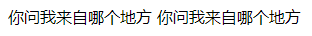
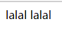
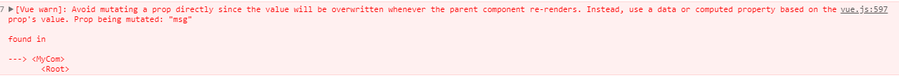
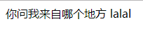

##组件化
组件化的概念
组件化的特性以及优点
###vue中的组件
####props
props中的数据是单向数据流(父 -> 子)，只能读
下面举一个例子
页面中显示的是这些文字，点击后面的文字之后

文字会变成这个样子，虽然改变成功，但是却存在风险

看一下控制台的报错

```js
<div id="app">
    <my-com :msg="title"></my-com>
</div>
<script>
    const myCom = {
        template: `
        <div>
            {{msg}}
            <span @click="doit">{{msg}}</span>
        </div>
        `,
        props: {
            msg: {
                type: String
            }
        },
        methods: {
            doit() {
                // 这样子会让子组件影响父组件
                this.msg = 'lalal';
            }
        }
    }
    new Vue({
        el: '#app',
        components: {
            myCom
        },
        data() {
            return {
                title: '你问我来自哪个地方'
            }
        }
    })
</script>
```
如果真的要改变某些数据的话，点击后面文字

会变成以下的样子，不会影响到父组件的问题

```js
<div id="app">
    <my-com :msg="title"></my-com>
</div>
<script>
const myCom = {
    template: `
    <div>
        {{msg}}
        <span @click="doit">{{newMsg}}</span>
    </div>
    `,
    props: {
        msg: {
            type: String
        }
    },
    // 如果想要改变数据的话，使用data
    data() {
        return {
            newMsg: this.msg
        }
    },
    methods: {
        doit() {
            // 这样子会让子组件影响父组件
            this.newMsg = 'lalal';
        }
    }
}
new Vue({
    el: '#app',
    components: {
        myCom
    },
    data() {
        return {
            title: '你问我来自哪个地方'
        }
    }
})
</script>
```
###SLOT
####编译作用域
####插槽
####
