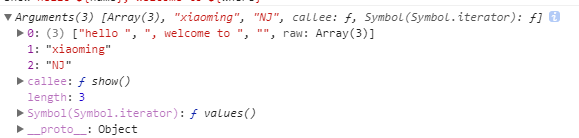

## let和const以及块级作用域
#### let命令使用
* 不存在变量提升
* 暂时性死区
* 不允许重复声明
#### const
* const声明的数值没法改变
* 声明的对象可以改变
## 解构赋值
* 基本用法
``` js
let [a, b, c] = [1, 2, 3];
//a = 1,b = 2,c = 3
```
* 解构不成功
``` js
let [a, b] = [1];
//a = 1, b = undefined
```
* 不完全解构
``` js
let [a, b] = [1, 2, 3];
//a = 1, b = 22
```
* 默认值
``` js
let [a, b = 10] = [1];
//a = 1, b = 10
// 先找匹配的之，如果匹配的只会直接忽略默认值
```
* 对象的解构赋值
``` js
let {bar, foo} = {foo :234, bar : 123}
console.log(bar, foo);
//123    234
//对象的解构赋值是无序的
```
``` js
let {bar} = {foo: 234, bar: 123}
console.log(bar);
//123
//报错foo没有被定义
```
* 交换两个数字
``` js
let a = 5,b = 4;
[a, b] = [b, a];
```
## 字符串的扩展
#### 模板字符串
* 用法
``` js
let a = 'lalal'
`name ${a}`
//name lalal
```
* 在字符串中添加变量
``` js
let [x, y] = [1, 2];
function getName() {
    return 'name'
}
//x+y 3
`x+y ${x+y}`
//name
`${getName()}`
```
* 外层模板字符串内嵌
```js 
var arr = [1, 2, 3, 4, 5];
var resStr = `${arr.map(function (item, index) {
    return `${item}:${index}`
})}`
//resStr "1:0,2:1,3:2,4:3,5:4"
```
#### 标签模板
* 标签模板实质--函数调用的特殊形式
```js
var name = 'xiaoming';
var where = 'NJ';
function show() {
    console.log(arguments);
}
show`hello ${name}, welcome to ${where}`
//打印出来有三个参数，如下图
```

``` js
show(['hello ', ', welcome to ', ''], name, where)
```
* 重要应用--过滤HTML字符串（防止注入XSS攻击）
``` js
var name = '<script>alert("aaa")<\/script>';
safeHTML`<p>${name} Welcome to the world!!!</p>`;
function safeHTML(data) {
    var str = data[0];
    for(let i = 1; i < arguments.length; i ++) {
        var arg = String(arguments[i]);
        str += arg.replace(/&/g, '&amp;').replace(/</g, '&lt;').replace(/>/g, '&gt;');
        str += data[i];
    }
    console.log(str);
}
```
#### 函数参数的默认值
* 如何设置默认值
``` js
//设置默认值
function Person (name, age=18) {
    console.log(name, age);
}
```
* 与解构赋值一起使用
``` js
function fn({x, y=5}) {
    console.log(x, y);
}
fn({});             //undefined 5
fn({x:1});          //1 5
fn({x: 1, y: 2});   //1 2
fn();               //参数不是对象，无法解构，就会报错

function f1({x=0, y=0} = {}) {
    console.log(x, y);
}
function f2({x, y} = {x: 0, y: 0}) {
    console.log(x,y)
}
f1();           //0 0
f2();           //0 0
f1({x:1, y:2}); //1 2
f2({x:1, y:2}); //1 2
f1({x:1});      //1 0 {x=0, y=0} = {x:1}
f2({x:1});      //1 undefined {x, y} = {x:1}
```
#### 参数作用域以及注意事项
``` js
//不会报错,是用过var x, var x
function fn(x, x) {
    console.log(x);
}
//这个就变成了let x, let x所以会报错
function fn(x, x, y=4) {
    console.log(x);
}

//如果去掉这行会报错
let x = 10;

function fn(y = x) {
    let x = 10;
    console.log(y, x);
}
fn();   //10,10
```
## 数组的扩展
#### 扩展运算符
``` js
function fn(...arg) {
    console.log(...arg);
    console.log(arg);
}
fn(1,2,3,4,5);
//[1, 2, 3, 4, 5];
//1 2 3 4 5
```
``` js
var arr = [1,2,3,4,5];
fn.call(null,...arr);    //[1, 2, 3, 4, 5];
fn.call(null,1,2,3,4,5);    //[1, 2, 3, 4, 5];
fn.apply(null,[1,2,3,4,5]); //[1, 2, 3, 4, 5];
function fn(...arg) {
    console.log(arg);
}
```
``` js
var arr = [1,2,3,4,5],
    arr1 = [],
    arr2 = [],
    arr3 = [];
    // es6方法
    arr1.push(...arr);
    //arr1  [1, 2, 3, 4, 5]
    // 之前的方法
    Array.prototype.push.apply(arr2, arr);
    var newArr3 = arr3.concat(arr);
    //concat返回一个连接后的值，不改变arr3的值
    //arr2  [1, 2, 3, 4, 5]
```
合并多个数组
``` js
var a = [1, 2, 3],
    b = [false, true],
    c = ['xa', 'asd'];

var d = [...a, ...b, ...c];
console.log(d); //[1, 2, 3, false, true, "xa", "asd"]
```
赋值
``` js
var [x, ...y] = [1,2,3,4,5];
//x=1,y=[2,3,4,5]
var strArr = [...'xiaoming'];
//把类数组转换为数组
//strArr ["x", "i", "a", "o", "m", "i", "n", "g"]
```
#### Array.from()
Array.from方法用于将两类对象转为真正的数组：类似数组的对象（array-like object）和可遍历（iterable）的对象（包括 ES6 新增的数据结构 Set 和 Map）。
``` js
let arrayLike = {
    '0': 'a',
    '1': 'b',
    '2': 'c',
    length: 3
};

// ES5的写法
var arr1 = [].slice.call(arrayLike); // ['a', 'b', 'c']

// ES6的写法
let arr2 = Array.from(arrayLike); // ['a', 'b', 'c']

//其他作用
var arr3 = Array.from(arrayLike, function(item, index){
    return item + index;
})
var arr4 = Array.from(arrayLike).map((item, index) => item + index)
// arr3   ["a0", "b1", "c2"]
// arr4   ["a0", "b1", "c2"]

var arr1 = [1,2,3,4];
var arr2 = Array.from(arr1);    //[1,2,3,4]
console.log(arr1 == arr2);      //false，因为地址不一样
```
typeof的用法
``` js
function typeOf() {
    return Array.from(arguments, item => typeof item);
}
typeOf('1', false, NaN, null, []);
//["string", "boolean", "number", "object", "object"]
```
#### Array.of()
将一组值，转换为数组
```js
//创建数组
var arr = Array.of(1,2,3,4,5);
var arr1 = new Array(1,2,3,4,5);

//创建数组
var arr = Array.of(6);          //[6]，弥补了原来的不足
var arr1 = new Array(6);        //创建长度为6都为空值的数组

//模拟Array.of
function arrayOf() {
    return Array.from(arguments);
}
//或者
function arrayOf() {
    return Array.prototype.slice.call(arguments);
}
```
#### copyWithin()
数组实例的copyWithin方法，在当前数组内部，将指定位置的成员复制到其他位置（会覆盖原有成员），然后返回当前数组。也就是说，使用这个方法，会修改当前数组。
``` js
Array.prototype.copyWithin(target, start=0, end=this.length)
```
它接受三个参数。
target（必需）：从该位置开始替换数据。如果为负值，表示倒数。
start（可选）：从该位置开始读取数据，默认为 0。如果为负值，表示倒数。
end（可选）：到该位置前停止读取数据，默认等于数组长度。如果为负值，表示倒数。
这三个参数都应该是数值，如果不是，会自动转为数值。
``` js
//将3号位复制到0号位
[1, 2, 3, 4, 5].copyWithin(0, 3)
// [4, 5, 3, 4, 5]
```
#### 数组实例方法
* fill()
使用给定值，填充一个数组
``` js
['a', 'b', 'c'].fill(7);
// [7, 7, 7]
new Array(3).fill(7)
// [7, 7, 7]
```
还可以接受第二个和第三个参数，用于指定填充的起始位置和结束位置
``` js
['a', 'b', 'c'].fill(7, 1, 2)
// ['a', 7, 'c']
```
* entries(), keys(), values()
用来遍历数组
```js
for (let index of ['a', 'b'].keys()) {
  console.log(index);
}
// 0
// 1

for (let elem of ['a', 'b'].values()) {
  console.log(elem);
}
// 'a'
// 'b'
```
如果不使用for...of循环,可以手动调用b遍历器的对象next方法,进行遍历
``` js
let letter = ['a', 'b', 'c'];
let entries = letter.entries();
console.log(entries.next().value); // [0, 'a']
console.log(entries.next().value); // [1, 'b']
console.log(entries.next().value); // [2, 'c']
```
#### includes(), find(), findIndex()
用于找出第一个符合条件的数组成员。它的参数是一个回调函数，所有数组成员依次执行该回调函数，直到找出第一个返回值为true的成员，然后返回该成员。如果没有符合条件的成员，则返回undefined。
``` js
[1,2,-5,10].find((n) => < 0)    //5
```
find方法的回调函数可以接受三个参数，依次为当前的值、当前的位置和原数组。
``` js
[1,5,10,15].find(function(value, index, arr) {
    return value > 9;
})      //10
```
## 函数的扩展
#### 箭头函数
``` js
var f = name => name;
var fn = num => {
    num = num + 1;
    return num;
}

//嵌套使用
function fn(str) {
    return function () {
        console.log(str.split(''));
    }
}
fn('123')();
//等同于
var fn1 = str => () => {
    console.log(str.split(''));
};
fn1('123')();
```
## 对象的扩展
#### 属性的简洁表示方法
``` js
const foo = 'bar';
const baz = {foo};  //{foo :'baz'}
//等同于 
const baz = {foo : foo}
```
``` js
function f(x, y) {
  return {x, y};
}
// 等同于
function f(x, y) {
  return {x: x, y: y};
}
f(1, 2) // Object {x: 1, y: 2}
```
方法的简写
``` js
const o = {
  method() {
    return "Hello!";
  }
};
// 等同于
const o = {
  method: function() {
    return "Hello!";
  }
};
```